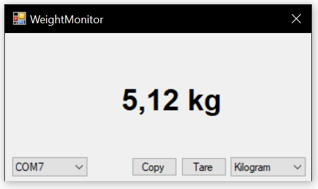

# Weigh-Scale-To-PC 

Small Windows Forms application for the [Weigh-Scale-Arduino](https://github.com/MaxAtoms/Weigh-Scale-Arduino) project. 
It reads the current weight on the scale from a serial port and displays it. Furthermore the applications also allows to tare the scale and switch between units.